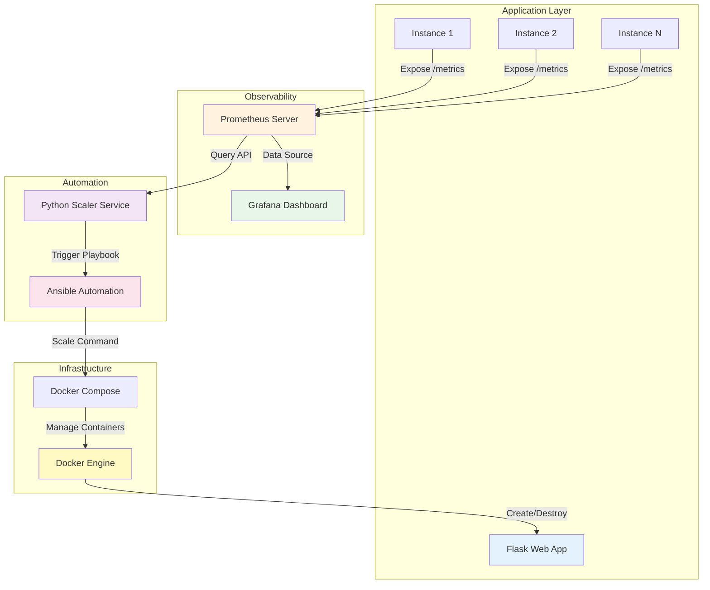
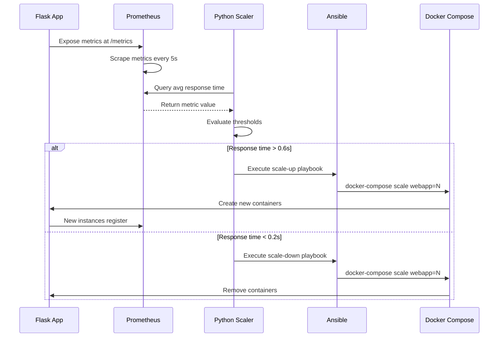
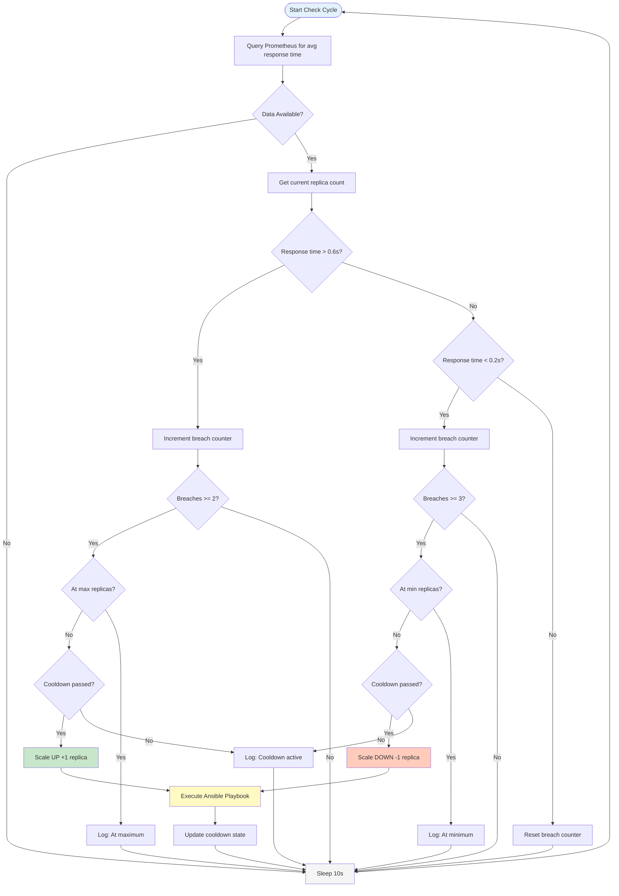

# Prometheus-Driven Auto-Scaling Simulator

A comprehensive local simulation environment demonstrating metrics-driven auto-scaling using Prometheus, Grafana, Python, Docker, and Ansible. This project showcases observability-driven automation patterns without requiring cloud infrastructure or costs.

## Table of Contents

- [Project Overview](#project-overview)
- [Architecture](#architecture)
- [Prerequisites](#prerequisites)
- [Project Structure](#project-structure)
- [Installation Guide](#installation-guide)
- [Configuration](#configuration)
- [Running the Project](#running-the-project)
- [Monitoring and Observability](#monitoring-and-observability)
- [Testing Auto-Scaling](#testing-auto-scaling)
- [Understanding the Components](#understanding-the-components)
- [Troubleshooting](#troubleshooting)
- [Advanced Usage](#advanced-usage)
- [Production Considerations](#production-considerations)

---

## Project Overview

This project simulates a production auto-scaling environment on your local machine. It demonstrates:

- Metrics collection and storage using Prometheus
- Real-time visualization with Grafana dashboards
- Automated scaling decisions based on performance thresholds
- Infrastructure automation using Ansible playbooks
- Container orchestration with Docker Compose

### Key Features

- Zero cloud costs - runs entirely on local machine
- Real-time metrics monitoring and alerting
- Automatic scaling based on response time thresholds
- Configurable scaling policies and cooldown periods
- Comprehensive logging and history tracking
- Production-ready code structure

### Use Cases

- Learning observability and auto-scaling concepts
- Testing scaling logic before production deployment
- Demonstrating SRE automation patterns
- Developing custom scaling algorithms
- Interview project demonstrations

---

## Architecture

### High-Level Architecture



### Data Flow



### Scaling Decision Flow



---

## Prerequisites

### Required Software

#### 1. Docker Engine

**Version**: 20.10 or higher

**Installation**:

Ubuntu/Debian:
```bash
# Update package index
sudo apt-get update

# Install prerequisites
sudo apt-get install -y \
    apt-transport-https \
    ca-certificates \
    curl \
    gnupg \
    lsb-release

# Add Docker GPG key
curl -fsSL https://download.docker.com/linux/ubuntu/gpg | sudo gpg --dearmor -o /usr/share/keyrings/docker-archive-keyring.gpg

# Set up repository
echo \
  "deb [arch=$(dpkg --print-architecture) signed-by=/usr/share/keyrings/docker-archive-keyring.gpg] https://download.docker.com/linux/ubuntu \
  $(lsb_release -cs) stable" | sudo tee /etc/apt/sources.list.d/docker.list > /dev/null

# Install Docker
sudo apt-get update
sudo apt-get install -y docker-ce docker-ce-cli containerd.io

# Add user to docker group
sudo usermod -aG docker $USER
newgrp docker

# Verify installation
docker --version
```

macOS:
```bash
# Download Docker Desktop from https://www.docker.com/products/docker-desktop
# Or use Homebrew
brew install --cask docker

# Start Docker Desktop application
open /Applications/Docker.app

# Verify installation
docker --version
```

Windows:
```powershell
# Download Docker Desktop from https://www.docker.com/products/docker-desktop
# Install and start Docker Desktop
# Open PowerShell and verify
docker --version
```

#### 2. Docker Compose

**Version**: 2.0 or higher

**Installation**:

Linux:
```bash
# Download Docker Compose
sudo curl -L "https://github.com/docker/compose/releases/download/v2.23.0/docker-compose-$(uname -s)-$(uname -m)" -o /usr/local/bin/docker-compose

# Apply executable permissions
sudo chmod +x /usr/local/bin/docker-compose

# Verify installation
docker-compose --version
```

macOS/Windows:
```bash
# Already included with Docker Desktop
docker-compose --version
```

#### 3. Git

**Installation**:

Ubuntu/Debian:
```bash
sudo apt-get update
sudo apt-get install -y git
git --version
```

macOS:
```bash
brew install git
git --version
```

Windows:
```powershell
# Download from https://git-scm.com/download/win
# Or use Chocolatey
choco install git
git --version
```

#### 4. Text Editor

Any text editor will work. Recommended options:
- Visual Studio Code
- Sublime Text
- Vim/Nano (for terminal editing)

### System Requirements

- **CPU**: 2 cores minimum, 4 cores recommended
- **RAM**: 4GB minimum, 8GB recommended
- **Disk**: 10GB free space
- **OS**: Linux, macOS, or Windows 10/11 with WSL2
- **Network**: Internet connection for downloading images

### Optional Tools

For enhanced experience:

```bash
# curl - for API testing
sudo apt-get install curl

# jq - for JSON parsing
sudo apt-get install jq

# htop - for system monitoring
sudo apt-get install htop

# bc - for calculations in load test script
sudo apt-get install bc
```

---

## Project Structure

```
prometheus-autoscale-sim/
├── README.md                          # This file
├── docker-compose.yml                 # Main orchestration file
├── .gitignore                        # Git ignore patterns
│
├── app/                              # Flask web application
│   ├── app.py                        # Main application code
│   ├── requirements.txt              # Python dependencies
│   └── Dockerfile                    # Container image definition
│
├── scaler/                           # Auto-scaling service
│   ├── scaler.py                     # Scaling logic implementation
│   ├── requirements.txt              # Python dependencies
│   └── Dockerfile                    # Container image definition
│
├── prometheus/                       # Prometheus configuration
│   └── prometheus.yml                # Scrape and storage config
│
├── prometheus_rules/                 # Alert rules
│   └── alert_rules.yml               # Alert definitions
│
├── grafana/                          # Grafana configuration
│   └── provisioning/
│       ├── datasources/
│       │   └── prometheus.yml        # Data source config
│       └── dashboards/
│           ├── dashboard.yml         # Dashboard provider config
│           └── autoscaling-dashboard.json  # Dashboard definition
│
├── ansible/                          # Ansible automation
│   ├── ansible.cfg                   # Ansible configuration
│   ├── playbook-scale.yml            # Scaling playbook
│   └── requirements.yml              # Ansible collections
│
└── scripts/                          # Utility scripts
    ├── start.sh                      # Start all services
    ├── stop.sh                       # Stop all services
    └── load-test.sh                  # Generate load for testing
```

### Component Descriptions

| Component | Purpose | Technology |
|-----------|---------|------------|
| Flask App | Web application that exposes metrics | Python, Flask, prometheus_client |
| Prometheus | Metrics collection and storage | Prometheus Server |
| Grafana | Metrics visualization | Grafana |
| Scaler | Auto-scaling decision engine | Python, requests |
| Ansible | Infrastructure automation | Ansible, YAML |
| Docker Compose | Container orchestration | Docker Compose |

---

## Installation Guide

### Step 1: Clone the Repository

```bash
# Create a project directory
mkdir -p ~/projects
cd ~/projects

# Clone the repository (replace with your repository URL)
git clone https://github.com/yourusername/prometheus-autoscale-sim.git

# Navigate to project directory
cd prometheus-autoscale-sim

# Verify directory structure
ls -la
```

Expected output:
```
drwxr-xr-x  app/
drwxr-xr-x  scaler/
drwxr-xr-x  prometheus/
drwxr-xr-x  grafana/
drwxr-xr-x  ansible/
drwxr-xr-x  scripts/
-rw-r--r--  docker-compose.yml
-rw-r--r--  README.md
```

### Step 2: Create Required Files

If you are setting up from scratch without cloning:

```bash
# Create directory structure
mkdir -p app scaler prometheus prometheus_rules grafana/provisioning/datasources grafana/provisioning/dashboards ansible scripts

# Create empty configuration files
touch docker-compose.yml
touch app/{app.py,requirements.txt,Dockerfile}
touch scaler/{scaler.py,requirements.txt,Dockerfile}
touch prometheus/prometheus.yml
touch prometheus_rules/alert_rules.yml
touch ansible/{ansible.cfg,playbook-scale.yml,requirements.yml}
touch grafana/provisioning/datasources/prometheus.yml
touch grafana/provisioning/dashboards/{dashboard.yml,autoscaling-dashboard.json}
touch scripts/{start.sh,stop.sh,load-test.sh}
touch .gitignore README.md
```

### Step 3: Make Scripts Executable

```bash
# Make all shell scripts executable
chmod +x scripts/*.sh

# Verify permissions
ls -la scripts/
```

Expected output:
```
-rwxr-xr-x  start.sh
-rwxr-xr-x  stop.sh
-rwxr-xr-x  load-test.sh
```

### Step 4: Verify Docker Installation

```bash
# Check Docker is running
docker info

# Check Docker Compose version
docker-compose --version

# Test Docker with hello-world
docker run hello-world
```

If you see "Hello from Docker!", you are ready to proceed.

### Step 5: Pull Required Base Images

Pre-download base images to speed up first startup:

```bash
# Pull Prometheus image
docker pull prom/prometheus:latest

# Pull Grafana image
docker pull grafana/grafana:10.0.0

# Pull Python base image
docker pull python:3.11-slim

# Verify images
docker images
```

### Step 6: Create Docker Networks

Docker Compose will create networks automatically, but you can pre-create them:

```bash
# Create monitoring network
docker network create autoscale-network

# List networks
docker network ls
```

---

## Configuration

### Environment Variables

All services are configurable via environment variables in `docker-compose.yml`.

#### Scaler Configuration

Edit the scaler service section in `docker-compose.yml`:

```yaml
scaler:
  environment:
    - PROMETHEUS_URL=http://prometheus:9090  # Prometheus endpoint
    - SERVICE_NAME=webapp                     # Service to scale
    - SCALE_UP_THRESHOLD=0.6                  # Scale up if response time > 0.6s
    - SCALE_DOWN_THRESHOLD=0.2                # Scale down if response time < 0.2s
    - MAX_REPLICAS=6                          # Maximum number of replicas
    - MIN_REPLICAS=1                          # Minimum number of replicas
    - CHECK_INTERVAL=10                       # Seconds between checks
    - SCALE_UP_COOLDOWN=30                    # Cooldown after scale-up (seconds)
    - SCALE_DOWN_COOLDOWN=60                  # Cooldown after scale-down (seconds)
```

#### Prometheus Configuration

Edit `prometheus/prometheus.yml`:

```yaml
global:
  scrape_interval: 5s      # How often to scrape metrics
  evaluation_interval: 5s  # How often to evaluate rules

scrape_configs:
  - job_name: 'webapp'
    scrape_interval: 5s    # Override global interval
    metrics_path: /metrics # Metrics endpoint path
    dns_sd_configs:
      - names: ['webapp']
        type: 'A'
        port: 8000
```

#### Grafana Configuration

Default credentials (change in production):

```yaml
grafana:
  environment:
    - GF_SECURITY_ADMIN_USER=admin
    - GF_SECURITY_ADMIN_PASSWORD=admin  # Change this!
```

### Scaling Thresholds

Adjust thresholds based on your testing needs:

| Scenario | Scale Up Threshold | Scale Down Threshold | Max Replicas |
|----------|-------------------|---------------------|--------------|
| Conservative | 0.8s | 0.1s | 4 |
| Moderate (default) | 0.6s | 0.2s | 6 |
| Aggressive | 0.4s | 0.3s | 10 |

### Port Configuration

Default ports used:

| Service | Port | Purpose |
|---------|------|---------|
| Grafana | 3000 | Web UI |
| Prometheus | 9090 | Web UI and API |
| Flask App | 8000-8010 | Application endpoints |

To change ports, edit the `ports` section in `docker-compose.yml`:

```yaml
grafana:
  ports:
    - "3001:3000"  # Change host port from 3000 to 3001
```

---

## Running the Project

### Quick Start

```bash
# Navigate to project directory
cd prometheus-autoscale-sim

# Start all services
./scripts/start.sh

# Wait for services to initialize (about 30 seconds)
```

### Manual Start

```bash
# Build all images
docker-compose build

# Start services in detached mode
docker-compose up -d

# View logs
docker-compose logs -f
```

### Verify Services are Running

```bash
# Check all containers
docker-compose ps

# Expected output:
# NAME                    STATUS              PORTS
# prometheus              Up 30 seconds       0.0.0.0:9090->9090/tcp
# grafana                 Up 30 seconds       0.0.0.0:3000->3000/tcp
# webapp                  Up 30 seconds       0.0.0.0:8000->8000/tcp
# scaler                  Up 30 seconds

# Check health status
docker-compose ps | grep healthy
```

### Access Web Interfaces

Open your web browser and navigate to:

1. **Grafana Dashboard**
   - URL: http://localhost:3000
   - Username: admin
   - Password: admin
   - First login will prompt to change password

2. **Prometheus UI**
   - URL: http://localhost:9090
   - Navigate to Status > Targets to see scrape targets
   - Navigate to Graph to query metrics manually

3. **Flask Application**
   - URL: http://localhost:8000
   - Health check: http://localhost:8000/health
   - Metrics: http://localhost:8000/metrics

### View Logs

```bash
# View all logs
docker-compose logs

# Follow logs in real-time
docker-compose logs -f

# View specific service logs
docker-compose logs -f scaler
docker-compose logs -f webapp
docker-compose logs -f prometheus

# View last 50 lines
docker-compose logs --tail=50 scaler

# Filter logs for scaling events
docker-compose logs scaler | grep -i scaling
```

### Stop Services

```bash
# Stop all services gracefully
./scripts/stop.sh

# Or manually
docker-compose stop

# Stop and remove containers
docker-compose down

# Stop and remove containers and volumes (deletes all data)
docker-compose down -v
```

---

## Monitoring and Observability

### Grafana Dashboard

#### Initial Setup

1. Open Grafana at http://localhost:3000
2. Login with admin/admin
3. Change default password when prompted
4. Navigate to Dashboards > Browse
5. Select "Auto-Scaling Simulator Dashboard"

#### Dashboard Panels

The pre-configured dashboard includes:

1. **Average Response Time (30s)** - Gauge
   - Shows current average response time
   - Color-coded thresholds (green < 0.4s, yellow < 0.6s, red >= 0.6s)

2. **Response Time Over Time** - Time series
   - Individual instance response times
   - 30-second moving average
   - Useful for identifying trends

3. **Active Replicas** - Stat panel
   - Current number of running replicas
   - Color-coded (red = 1, yellow = 2, green >= 3)

4. **Service Health** - Stat panel
   - Up/Down status per instance
   - Green = healthy, Red = down

5. **Request Count** - Time series
   - Simulated request load per instance

6. **Replica Count Over Time** - Time series
   - Historical view of scaling actions
   - Step graph showing replica changes

7. **Request Rate** - Time series
   - Requests per second per instance
   - Shows load distribution

8. **Response Time Percentiles** - Time series
   - p50, p95, p99 percentiles
   - Helps identify outliers

#### Useful PromQL Queries

Execute these queries in Prometheus or Grafana:

```promql
# Current average response time (30s window)
avg_over_time(webapp_response_time_seconds[30s])

# Current number of healthy instances
count(up{job="webapp"} == 1)

# Response time per instance
webapp_response_time_seconds

# Request rate per second
rate(webapp_total_requests[1m])

# 95th percentile response time
histogram_quantile(0.95, rate(webapp_request_duration_seconds_bucket[5m]))

# Total requests across all instances
sum(webapp_total_requests)

# Average response time per instance
avg by (instance) (webapp_response_time_seconds)
```

### Prometheus Metrics

#### Application Metrics

| Metric Name | Type | Description |
|-------------|------|-------------|
| webapp_response_time_seconds | Gauge | Current simulated response time |
| webapp_request_count | Gauge | Current simulated request count |
| webapp_total_requests | Counter | Total requests processed |
| webapp_request_duration_seconds | Histogram | Request duration distribution |
| webapp_info | Gauge | Application metadata |
| webapp_health_status | Gauge | Health status (1=healthy, 0=unhealthy) |

#### Prometheus Built-in Metrics

| Metric Name | Description |
|-------------|-------------|
| up | Target scrape status (1=up, 0=down) |
| scrape_duration_seconds | Time taken to scrape target |
| scrape_samples_scraped | Number of samples scraped |

### Alert Rules

View active alerts in Prometheus:

1. Navigate to http://localhost:9090/alerts
2. Check alert status and active firing alerts
3. View alert history and evaluation times

Common alerts:

- **HighResponseTime**: Avg response time > 0.5s for 10s
- **CriticalResponseTime**: Avg response time > 1.0s for 30s
- **ServiceDown**: Instance down for 30s
- **MaxCapacityReached**: Running at maximum replicas for 2m

### Scaler Logs

Monitor scaler decisions in real-time:

```bash
# Watch scaler logs
docker-compose logs -f scaler

# Filter for specific events
docker-compose logs scaler | grep "Scaling decision"
docker-compose logs scaler | grep "Successfully scaled"
docker-compose logs scaler | grep "Cooldown active"

# View statistics
docker-compose logs scaler | grep "STATISTICS"
```

Expected log output:

```
scaler_1  | ============================================================
scaler_1  | Iteration #15 - 2024-01-15 10:30:45
scaler_1  | ============================================================
scaler_1  | Current State:
scaler_1  |   • Average Response Time (30s): 0.725s
scaler_1  |     WARNING ABOVE scale-up threshold (0.6s)
scaler_1  |   • Current Replicas: 2
scaler_1  | 
scaler_1  | ────────────────────────────────────────────────────────────
scaler_1  | SCALING ACTION REQUIRED
scaler_1  | ────────────────────────────────────────────────────────────
scaler_1  |   Direction: UP
scaler_1  |   Current:   2 replicas
scaler_1  |   Target:    3 replicas
scaler_1  |   Change:    +1 replicas
scaler_1  |   Executing scaling action...
scaler_1  |   Successfully scaled to 3 replicas
scaler_1  | ────────────────────────────────────────────────────────────
```

---

## Testing Auto-Scaling

### Manual Testing

#### Step 1: Generate Load

Use the provided load test script:

```bash
# Basic load test (60 seconds at 50 req/s)
./scripts/load-test.sh

# Custom duration and rate (120 seconds at 100 req/s)
./scripts/load-test.sh 120 100

# Light load (30 seconds at 20 req/s)
./scripts/load-test.sh 30 20
```

#### Step 2: Monitor Scaling

In separate terminal windows:

```bash
# Terminal 1: Watch scaler logs
docker-compose logs -f scaler

# Terminal 2: Watch container count
watch -n 2 'docker-compose ps webapp'

# Terminal 3: Monitor metrics
watch -n 2 'curl -s "http://localhost:9090/api/v1/query?query=avg_over_time(webapp_response_time_seconds[30s])" | jq'
```

#### Step 3: Observe Scaling Actions

Expected behavior:

1. **Initial State**: 1 replica running
2. **Load Applied**: Response time increases
3. **Threshold Breached**: Response time > 0.6s for 2 consecutive checks
4. **Scale Up**: Scaler triggers Ansible to add replica
5. **New Replica**: Container starts and registers with Prometheus
6. **Load Distributed**: Response time decreases
7. **Stabilization**: System maintains 2+ replicas
8. **Load Removed**: Response time drops below 0.2s
9. **Scale Down**: After 3 consecutive checks below threshold
10. **Return to Baseline**: Back to 1 replica

### Automated Testing

Create a test script to verify scaling behavior:

```bash
#!/bin/bash
# test-autoscaling.sh

echo "Starting auto-scaling test..."

# Get initial replica count
INITIAL=$(docker-compose ps webapp | grep -c "Up")
echo "Initial replicas: $INITIAL"

# Generate load
echo "Generating load for 60 seconds..."
./scripts/load-test.sh 60 100 &
LOAD_PID=$!

# Wait for scaling to occur
sleep 45

# Check if scaled up
CURRENT=$(docker-compose ps webapp | grep -c "Up")
echo "Current replicas: $CURRENT"

if [ $CURRENT -gt $INITIAL ]; then
    echo "TEST PASSED: Scaled from $INITIAL to $CURRENT replicas"
else
    echo "TEST FAILED: No scaling occurred"
fi

# Wait for load test to complete
wait $LOAD_PID

# Wait for scale down
echo "Waiting for scale down..."
sleep 90

# Check final state
FINAL=$(docker-compose ps webapp | grep -c "Up")
echo "Final replicas: $FINAL"

if [ $FINAL -eq $INITIAL ]; then
    echo "TEST PASSED: Scaled back to $FINAL replicas"
else
    echo "TEST WARNING: Final count $FINAL differs from initial $INITIAL"
fi
```

Make it executable and run:

```bash
chmod +x test-autoscaling.sh
./test-autoscaling.sh
```

### Performance Benchmarking

Use Apache Bench or similar tools for more rigorous testing:

```bash
# Install Apache Bench
sudo apt-get install apache2-utils

# Run benchmark (1000 requests, 10 concurrent)
ab -n 1000 -c 10 http://localhost:8000/

# Sustained load test (60 seconds, 50 concurrent)
ab -t 60 -c 50 http://localhost:8000/
```

### Scaling Scenarios

Test different scenarios:

#### Scenario 1: Gradual Load Increase

```bash
# Start with light load
./scripts/load-test.sh 30 20

# Wait 20 seconds
sleep 20

# Increase to moderate load
./scripts/load-test.sh 30 50

# Wait 20 seconds
sleep 20

# High load
./scripts/load-test.sh 30 100
```

#### Scenario 2: Spike Traffic

```bash
# Sudden traffic spike
./scripts/load-test.sh 10 200

# Observe rapid scaling response
```

#### Scenario 3: Sustained High Load

```bash
# Long duration high load
./scripts/load-test.sh 300 100

# Should scale to maximum and maintain
```

---

## Understanding the Components

### Flask Web Application

The Flask app simulates a production web service:

**Key Features**:
- Exposes Prometheus-compatible metrics at `/metrics`
- Simulates variable response times (0.05s - 1.25s)
- Generates synthetic load metrics
- Includes health check endpoints
- Runs with Gunicorn for production-like behavior

**Endpoints**:

```bash
# Main application
curl http://localhost:8000/

# Health check
curl http://localhost:8000/health

# Readiness check
curl http://localhost:8000/ready

# Prometheus metrics
curl http://localhost:8000/metrics

# Control load simulator
curl http://localhost:8000/load/increase
curl http://localhost:8000/load/decrease
curl http://localhost:8000/load/reset
curl http://localhost:8000/load/spike
```

**Code Structure**:

```python
# Main application class
class LoadSimulator:
    - get_simulated_response_time()  # Generate realistic latency
    - get_simulated_request_count()   # Generate request volume
    - update_load_factor()            # Simulate traffic changes

# Flask routes
@app.route('/')              # Main endpoint
@app.route('/health')        # Health check
@app.route('/metrics')       # Prometheus metrics
@app.route('/load/<action>') # Load control
```

### Prometheus Server

Prometheus collects and stores metrics:

**Configuration**:
- Scrapes webapp metrics every 5 seconds
- Evaluates alert rules every 5 seconds
- Retains data for 15 days
- Provides HTTP API for queries

**API Examples**:

```bash
# Query current metric
curl 'http://localhost:9090/api/v1/query?query=webapp_response_time_seconds'

# Query with time range
curl 'http://localhost:9090/api/v1/query_range?query=webapp_response_time_seconds&start=2024-01-15T10:00:00Z&end=2024-01-15T11:00:00Z&step=15s'

# Get all labels
curl 'http://localhost:9090/api/v1/labels'

# Get label values
curl 'http://localhost:9090/api/v1/label/job/values'

# Check targets
curl 'http://localhost:9090/api/v1/targets'
```

### Python Scaler Service

The scaler implements auto-scaling logic:

**Algorithm**:

1. Query Prometheus for average response time over 30s window
2. Get current replica count from Docker
3. Evaluate against thresholds:
   - Scale up if > 0.6s for 2 consecutive checks
   - Scale down if < 0.2s for 3 consecutive checks
4. Check cooldown periods (30s for up, 60s for down)
5. Execute Ansible playbook if scaling needed
6. Update state and sleep for 10 seconds

**Key Classes**:

```python
class PrometheusClient:
    - query()           # Execute PromQL query
    - query_range()     # Get time series data
    - health_check()    # Check Prometheus health

class DockerManager:
    - get_current_replicas()  # Count running containers
    - get_container_stats()   # Get resource usage

class ScalingDecisionEngine:
    - decide_scale()          # Make scaling decision
    - get_scaling_statistics() # Get history stats

class AnsibleExecutor:
    - scale_service()         # Execute playbook
```

**Configuration Options**:

All configurable via environment variables:

| Variable | Default | Description |
|----------|---------|-------------|
| PROMETHEUS_URL | http://prometheus:9090 | Prometheus endpoint |
| SERVICE_NAME | webapp | Service to scale |
| SCALE_UP_THRESHOLD | 0.6 | Response time for scale-up |
| SCALE_DOWN_THRESHOLD | 0.2 | Response time for scale-down |
| MAX_REPLICAS | 6 | Maximum container count |
| MIN_REPLICAS | 1 | Minimum container count |
| CHECK_INTERVAL | 10 | Seconds between checks |
| SCALE_UP_COOLDOWN | 30 | Cooldown after scale-up |
| SCALE_DOWN_COOLDOWN | 60 | Cooldown after scale-down |

### Ansible Automation

Ansible executes scaling operations:

**Playbook Flow**:

1. Validate parameters (target replica count)
2. Check current container status
3. Execute `docker-compose up --scale webapp=N`
4. Wait for containers to stabilize
5. Verify new container count
6. Report results

**Playbook Structure**:

```yaml
- name: Scale Docker Compose Service
  hosts: localhost
  tasks:
    - Validate target replicas
    - Get current service status
    - Scale service using docker-compose
    - Wait for containers to stabilize
    - Verify new service status
    - Display scaling result
```

**Manual Execution**:

```bash
# Scale to 3 replicas
ansible-playbook ansible/playbook-scale.yml -e target_replicas=3

# Scale to maximum
ansible-playbook ansible/playbook-scale.yml -e target_replicas=6

# Scale to minimum
ansible-playbook ansible/playbook-scale.yml -e target_replicas=1
```

### Grafana Dashboards

Grafana provides visualization:

**Dashboard Components**:
- 8 pre-configured panels
- 5-second refresh rate
- 15-minute default time range
- Auto-provisioned on startup

**Dashboard Customization**:

1. Edit existing panels:
   - Click panel title
   - Select "Edit"
   - Modify query or visualization
   - Click "Apply"

2. Add new panels:
   - Click "Add panel"
   - Select visualization type
   - Enter PromQL query
   - Configure display options
   - Save dashboard

3. Export dashboard:
   - Click dashboard settings
   - Select "JSON Model"
   - Copy JSON
   - Save to file

**Useful Grafana Features**:

- Variables for dynamic queries
- Annotations for marking events
- Alerts (requires Alertmanager integration)
- Templating for multi-environment support
- Snapshot sharing

---

## Troubleshooting

### Common Issues and Solutions

#### Issue 1: Services Not Starting

**Symptoms**:
```bash
docker-compose ps
# Shows "Exit 1" or "Restarting"
```

**Diagnosis**:
```bash
# Check logs for error messages
docker-compose logs scaler
docker-compose logs webapp
docker-compose logs prometheus

# Check Docker daemon
sudo systemctl status docker

# Check available resources
docker system df
```

**Solutions**:

1. Port already in use:
```bash
# Check what's using port 9090
sudo lsof -i :9090
sudo netstat -tulpn | grep 9090

# Kill process or change port in docker-compose.yml
```

2. Insufficient resources:
```bash
# Check available memory
free -h

# Check Docker resources
docker system info | grep -i memory

# Prune unused resources
docker system prune -a
```

3. Permission issues:
```bash
# Fix Docker socket permissions
sudo chmod 666 /var/run/docker.sock

# Add user to docker group
sudo usermod -aG docker $USER
newgrp docker
```

#### Issue 2: Prometheus Not Scraping Metrics

**Symptoms**:
- Targets show as "DOWN" in Prometheus UI
- No data in Grafana dashboards

**Diagnosis**:
```bash
# Check Prometheus targets
curl http://localhost:9090/api/v1/targets | jq

# Test connectivity from scaler to webapp
docker-compose exec scaler curl http://webapp:8000/metrics

# Check webapp logs
docker-compose logs webapp
```

**Solutions**:

1. DNS resolution issue:
```bash
# Test DNS from Prometheus container
docker-compose exec prometheus nslookup webapp

# Restart Docker network
docker-compose down
docker network prune
docker-compose up -d
```

2. Webapp not exposing metrics:
```bash
# Test metrics endpoint
curl http://localhost:8000/metrics

# Should return Prometheus format:
# HELP webapp_response_time_seconds Simulated response time
# TYPE webapp_response_time_seconds gauge
# webapp_response_time_seconds 0.234
```

3. Configuration error:
```bash
# Validate Prometheus config
docker-compose exec prometheus promtool check config /etc/prometheus/prometheus.yml

# Reload configuration
curl -X POST http://localhost:9090/-/reload
```

#### Issue 3: Scaler Not Triggering Scaling

**Symptoms**:
- High load but no new containers
- Scaler logs show no scaling decisions

**Diagnosis**:
```bash
# Check scaler is running
docker-compose ps scaler

# View scaler logs
docker-compose logs -f scaler

# Check Prometheus connectivity
docker-compose exec scaler curl http://prometheus:9090/-/healthy

# Verify metrics query
curl 'http://localhost:9090/api/v1/query?query=avg_over_time(webapp_response_time_seconds[30s])'
```

**Solutions**:

1. Cooldown period active:
```bash
# Wait for cooldown to expire
# Check logs for "Cooldown active" message
# Default: 30s for scale-up, 60s for scale-down
```

2. Threshold not reached:
```bash
# Check current response time
docker-compose logs scaler | grep "Average Response Time"

# Adjust thresholds in docker-compose.yml
# Restart scaler: docker-compose restart scaler
```

3. Ansible execution failure:
```bash
# Check Ansible is installed
docker-compose exec scaler ansible --version

# Test playbook manually
docker-compose exec scaler ansible-playbook /ansible/playbook-scale.yml -e target_replicas=2
```

4. Docker socket access:
```bash
# Check socket is mounted
docker-compose exec scaler ls -la /var/run/docker.sock

# Should show: srw-rw---- 1 root docker 0 ...

# If permission denied:
sudo chmod 666 /var/run/docker.sock
```

#### Issue 4: Grafana Dashboard Shows No Data

**Symptoms**:
- Dashboard panels show "No Data"
- Queries return empty results

**Diagnosis**:
```bash
# Check Grafana data source
curl -u admin:admin http://localhost:3000/api/datasources

# Test Prometheus from Grafana container
docker-compose exec grafana curl http://prometheus:9090/api/v1/query?query=up

# Check time range in dashboard
# Click time picker, ensure it includes recent data
```

**Solutions**:

1. Data source not configured:
```bash
# Check provisioning files
ls -la grafana/provisioning/datasources/

# Restart Grafana
docker-compose restart grafana

# Manually add data source:
# - Go to Configuration > Data Sources
# - Add Prometheus
# - URL: http://prometheus:9090
# - Save & Test
```

2. Time range issue:
```bash
# Dashboard showing old time range
# Click time picker (top right)
# Select "Last 15 minutes"
# Enable auto-refresh (5s)
```

3. Query syntax error:
```bash
# Test query in Prometheus first
# Navigate to http://localhost:9090/graph
# Enter query: webapp_response_time_seconds
# Should return results

# Copy working query to Grafana panel
```

#### Issue 5: Containers Exiting Immediately

**Symptoms**:
```bash
docker-compose ps
# Shows "Exit 0" or "Exit 1"
```

**Diagnosis**:
```bash
# View exit logs
docker-compose logs --tail=50 webapp
docker-compose logs --tail=50 scaler

# Check container exit code
docker inspect <container_id> | jq '.[0].State'
```

**Solutions**:

1. Application error:
```bash
# Check for Python errors
docker-compose logs webapp | grep -i error
docker-compose logs scaler | grep -i error

# Common issues:
# - Missing Python dependencies
# - Syntax errors
# - Import errors

# Rebuild images
docker-compose build --no-cache
docker-compose up -d
```

2. Configuration file error:
```bash
# Validate YAML files
python -c "import yaml; yaml.safe_load(open('docker-compose.yml'))"

# Check for syntax errors in Prometheus config
docker-compose run prometheus promtool check config /etc/prometheus/prometheus.yml
```

#### Issue 6: High CPU or Memory Usage

**Symptoms**:
- System becomes slow
- Docker containers using excessive resources

**Diagnosis**:
```bash
# Check container resource usage
docker stats

# Check system resources
htop

# Check Docker disk usage
docker system df
```

**Solutions**:

1. Set resource limits:

Edit `docker-compose.yml`:
```yaml
webapp:
  deploy:
    resources:
      limits:
        cpus: '0.5'
        memory: 256M
      reservations:
        cpus: '0.25'
        memory: 128M
```

2. Reduce check intervals:
```yaml
scaler:
  environment:
    - CHECK_INTERVAL=30  # Increase from 10 to 30 seconds
```

3. Clean up unused resources:
```bash
# Remove unused containers
docker container prune

# Remove unused images
docker image prune -a

# Remove unused volumes
docker volume prune

# Complete cleanup
docker system prune -a --volumes
```

#### Issue 7: Load Test Script Fails

**Symptoms**:
```bash
./scripts/load-test.sh
# Error: bc: command not found
```

**Solutions**:

```bash
# Install bc calculator
sudo apt-get install bc

# Or modify script to use awk instead
# Edit scripts/load-test.sh
# Replace: DELAY=$(echo "scale=4; 1 / $REQUESTS_PER_SECOND" | bc)
# With: DELAY=$(awk "BEGIN {print 1/$REQUESTS_PER_SECOND}")
```

### Debug Mode

Enable verbose logging for troubleshooting:

```bash
# Stop services
docker-compose down

# Start with verbose logs
docker-compose up

# Or enable debug in Python scaler
# Edit scaler/scaler.py
# Change: level=logging.INFO
# To: level=logging.DEBUG

# Rebuild and restart
docker-compose up -d --build scaler
```

### Health Checks

Verify each component is healthy:

```bash
# Check Docker daemon
sudo systemctl status docker

# Check all containers
docker-compose ps

# Test Prometheus
curl http://localhost:9090/-/healthy

# Test Grafana
curl http://localhost:3000/api/health

# Test webapp
curl http://localhost:8000/health

# Test metrics endpoint
curl http://localhost:8000/metrics

# Test Prometheus query API
curl 'http://localhost:9090/api/v1/query?query=up'
```

---

## Advanced Usage

### Custom Scaling Policies

Modify the scaling logic in `scaler/scaler.py`:

#### Example 1: Scale Based on CPU Usage

```python
# In decide_scale() method
def decide_scale(self, current_metric, current_replicas, ...):
    # Query CPU usage instead of response time
    cpu_query = 'avg(rate(container_cpu_usage_seconds_total[1m]))'
    cpu_usage = prom_client.query(cpu_query)
    
    if cpu_usage > 0.8:  # 80% CPU
        return current_replicas + 1
    elif cpu_usage < 0.3:  # 30% CPU
        return current_replicas - 1
```

#### Example 2: Predictive Scaling

```python
# Scale based on trend, not just current value
def predict_scale(self, history):
    if len(history) < 5:
        return None
    
    # Calculate trend
    recent = [h['metric'] for h in history[-5:]]
    trend = (recent[-1] - recent[0]) / len(recent)
    
    # Scale up if trend is increasing
    if trend > 0.1:  # Rapid increase
        return current_replicas + 2
```

#### Example 3: Time-Based Scaling

```python
# Scale based on time of day
from datetime import datetime

def time_based_scale(self):
    hour = datetime.now().hour
    
    # Business hours: 9 AM - 5 PM
    if 9 <= hour < 17:
        return max(3, current_replicas)
    else:
        return max(1, current_replicas)
```

### Multiple Service Scaling

Scale multiple services simultaneously:

1. Add new service to `docker-compose.yml`:
```yaml
api:
  build: ./api
  ports:
    - "8001-8011:8001"
```

2. Update scaler to monitor both:
```python
# Query metrics for both services
webapp_rt = prom_client.query('webapp_response_time_seconds')
api_rt = prom_client.query('api_response_time_seconds')

# Scale each independently
scale_webapp(webapp_rt)
scale_api(api_rt)
```

### Integration with External Systems

#### Webhook Notifications

Add webhook calls on scaling events:

```python
import requests

def notify_scaling(action, replicas):
    webhook_url = "https://hooks.slack.com/services/YOUR/WEBHOOK/URL"
    message = {
        "text": f"Scaled {action} to {replicas} replicas"
    }
    requests.post(webhook_url, json=message)
```

#### Metric Export

Export metrics to external systems:

```python
# Export to CSV
def export_metrics():
    with open('metrics.csv', 'a') as f:
        f.write(f"{timestamp},{replicas},{response_time}\n")

# Export to database
import psycopg2
def store_metrics(conn):
    cursor = conn.cursor()
    cursor.execute(
        "INSERT INTO metrics VALUES (%s, %s, %s)",
        (timestamp, replicas, response_time)
    )
    conn.commit()
```

### Custom Metrics

Add application-specific metrics:

```python
# In app/app.py
from prometheus_client import Counter, Histogram

# Business metrics
orders_total = Counter('orders_total', 'Total orders processed')
order_value = Histogram('order_value_dollars', 'Order value distribution')

@app.route('/order')
def process_order():
    orders_total.inc()
    order_value.observe(calculate_order_value())
    return jsonify({'status': 'ok'})
```

### Load Testing Scenarios

#### Scenario 1: Gradual Ramp-Up

```bash
#!/bin/bash
# gradual-ramp.sh

echo "Starting gradual load ramp-up..."

for rate in 10 20 40 80 160; do
    echo "Load: $rate req/s for 30 seconds"
    ./scripts/load-test.sh 30 $rate
    sleep 10
done
```

#### Scenario 2: Spike Test

```bash
#!/bin/bash
# spike-test.sh

echo "Normal load..."
./scripts/load-test.sh 60 20 &

sleep 30

echo "Traffic spike!"
./scripts/load-test.sh 10 200

echo "Back to normal..."
./scripts/load-test.sh 60 20
```

#### Scenario 3: Soak Test

```bash
#!/bin/bash
# soak-test.sh

echo "Sustained load for 1 hour..."
./scripts/load-test.sh 3600 50
```

---

## Production Considerations

### Security Hardening

#### 1. Remove Docker Socket Mount

Current (development):
```yaml
volumes:
  - /var/run/docker.sock:/var/run/docker.sock
```

Production:
```yaml
environment:
  - DOCKER_HOST=tcp://docker-api:2376
  - DOCKER_TLS_VERIFY=1
  - DOCKER_CERT_PATH=/certs
volumes:
  - ./certs:/certs:ro
```

#### 2. Use Secrets Management

Current:
```yaml
environment:
  - PROMETHEUS_URL=http://prometheus:9090
```

Production:
```yaml
secrets:
  - prometheus_url
environment:
  - PROMETHEUS_URL_FILE=/run/secrets/prometheus_url
```

#### 3. Enable Authentication

Prometheus:
```yaml
prometheus:
  command:
    - '--web.config.file=/etc/prometheus/web-config.yml'
  volumes:
    - ./prometheus-auth.yml:/etc/prometheus/web-config.yml
```

Grafana:
```yaml
environment:
  - GF_AUTH_ANONYMOUS_ENABLED=false
  - GF_SECURITY_ADMIN_PASSWORD=${GRAFANA_PASSWORD}
```

#### 4. Network Segmentation

```yaml
networks:
  frontend:
    driver: bridge
  backend:
    driver: bridge
    internal: true

services:
  webapp:
    networks:
      - frontend
  
  prometheus:
    networks:
      - backend
  
  scaler:
    networks:
      - backend
```

### High Availability

#### 1. Multiple Prometheus Instances

```yaml
prometheus-1:
  image: prom/prometheus
  
prometheus-2:
  image: prom/prometheus
  
prometheus-lb:
  image: nginx
  depends_on:
    - prometheus-1
    - prometheus-2
```

#### 2. Grafana Clustering

```yaml
grafana:
  environment:
    - GF_DATABASE_TYPE=postgres
    - GF_DATABASE_HOST=postgres:5432
  deploy:
    replicas: 2
```

#### 3. Persistent Storage

```yaml
volumes:
  prometheus-data:
    driver: local
    driver_opts:
      type: nfs
      o: addr=nfs-server,rw
      device: ":/path/to/data"
```

### Cloud Migration

#### AWS Deployment

Replace components with AWS services:

| Component | AWS Service | Configuration |
|-----------|-------------|---------------|
| Prometheus | Amazon Managed Prometheus | CloudFormation template |
| Grafana | Amazon Managed Grafana | Workspace creation |
| Docker Compose | ECS/Fargate | Task definitions |
| Scaler | Lambda + EventBridge | Scaling function |
| Ansible | Systems Manager | Run commands |

Example Lambda function:
```python
import boto3

def lambda_handler(event, context):
    ecs = boto3.client('ecs')
    
    # Get current task count
    response = ecs.describe_services(
        cluster='my-cluster',
        services=['webapp']
    )
    current = response['services'][0]['desiredCount']
    
    # Scale based on metrics
    if event['metric_value'] > 0.6:
        new_count = min(10, current + 1)
        ecs.update_service(
            cluster='my-cluster',
            service='webapp',
            desiredCount=new_count
        )
```

#### Kubernetes Migration

Convert to Kubernetes manifests:

```yaml
apiVersion: autoscaling/v2
kind: HorizontalPodAutoscaler
metadata:
  name: webapp-hpa
spec:
  scaleTargetRef:
    apiVersion: apps/v1
    kind: Deployment
    name: webapp
  minReplicas: 1
  maxReplicas: 10
  metrics:
  - type: Pods
    pods:
      metric:
        name: webapp_response_time_seconds
      target:
        type: AverageValue
        averageValue: "0.6"
```

### Performance Optimization

#### 1. Reduce Prometheus Scrape Interval

```yaml
# prometheus.yml
global:
  scrape_interval: 15s  # Increase from 5s
```

#### 2. Use Recording Rules

```yaml
# prometheus_rules/recording_rules.yml
groups:
  - name: aggregations
    interval: 10s
    rules:
      - record: webapp:response_time:avg30s
        expr: avg_over_time(webapp_response_time_seconds[30s])
```

Query the pre-computed metric:
```python
# Instead of: avg_over_time(webapp_response_time_seconds[30s])
query = 'webapp:response_time:avg30s'
```

#### 3. Optimize Scaler Check Interval

```yaml
scaler:
  environment:
    - CHECK_INTERVAL=30  # Increase from 10 seconds
```

### Monitoring the Monitoring System

Create meta-monitoring:

```yaml
# prometheus_rules/meta_alerts.yml
- alert: ScalerDown
  expr: up{job="scaler"} == 0
  for: 1m
  annotations:
    summary: "Auto-scaler service is down"

- alert: PrometheusDown
  expr: up{job="prometheus"} == 0
  for: 1m
  annotations:
    summary: "Prometheus is down"

- alert: HighScrapeDuration
  expr: scrape_duration_seconds > 5
  for: 5m
  annotations:
    summary: "Prometheus scrapes taking too long"
```

### Cost Optimization

Track and optimize resource usage:

```bash
# Monitor resource consumption
docker stats --no-stream

# Calculate monthly cost estimate (AWS equivalent)
# t3.medium = $0.0416/hour
# 3 instances average * $0.0416 * 730 hours = $91/month

# Optimize by:
# 1. Reducing max replicas
# 2. Faster scale-down
# 3. Lower resource limits
```

### Backup and Recovery

```bash
#!/bin/bash
# backup.sh

# Backup Prometheus data
docker run --rm \
  -v prometheus-data:/data \
  -v $(pwd)/backups:/backup \
  alpine tar czf /backup/prometheus-$(date +%Y%m%d).tar.gz /data

# Backup Grafana dashboards
curl -u admin:admin \
  http://localhost:3000/api/search?type=dash-db \
  | jq -r '.[] | .uid' \
  | xargs -I {} curl -u admin:admin \
    http://localhost:3000/api/dashboards/uid/{} \
    > backups/dashboard-{}.json
```

---

## Appendix

### Complete Command Reference

#### Docker Commands

```bash
# Start services
docker-compose up -d

# Stop services
docker-compose stop

# Remove containers
docker-compose down

# Remove containers and volumes
docker-compose down -v

# View logs
docker-compose logs -f [service]

# Restart service
docker-compose restart [service]

# Rebuild images
docker-compose build --no-cache

# Scale manually
docker-compose up -d --scale webapp=3

# Execute command in container
docker-compose exec [service] [command]

# View resource usage
docker stats

# Prune unused resources
docker system prune -a --volumes
```

#### Prometheus Queries

```promql
# Current response time
webapp_response_time_seconds

# Average over time
avg_over_time(webapp_response_time_seconds[30s])

# Rate of change
rate(webapp_total_requests[1m])

# Sum across instances
sum(webapp_request_count)

# Count healthy instances
count(up{job="webapp"} == 1)

# Percentiles
histogram_quantile(0.95, rate(webapp_request_duration_seconds_bucket[5m]))

# Aggregation by label
avg by (instance) (webapp_response_time_seconds)
```

#### Grafana API

```bash
# List dashboards
curl -u admin:admin http://localhost:3000/api/search

# Get dashboard
curl -u admin:admin http://localhost:3000/api/dashboards/uid/autoscaling-sim

# Create dashboard
curl -X POST -u admin:admin \
  -H "Content-Type: application/json" \
  -d @dashboard.json \
  http://localhost:3000/api/dashboards/db

# List data sources
curl -u admin:admin http://localhost:3000/api/datasources

# Test data source
curl -u admin:admin http://localhost:3000/api/datasources/1/health
```

### Environment Variables Reference

| Variable | Service | Default | Description |
|----------|---------|---------|-------------|
| PROMETHEUS_URL | scaler | http://prometheus:9090 | Prometheus API endpoint |
| SERVICE_NAME | scaler | webapp | Service to scale |
| SCALE_UP_THRESHOLD | scaler | 0.6 | Scale-up threshold (seconds) |
| SCALE_DOWN_THRESHOLD | scaler | 0.2 | Scale-down threshold (seconds) |
| MAX_REPLICAS | scaler | 6 | Maximum replicas |
| MIN_REPLICAS | scaler | 1 | Minimum replicas |
| CHECK_INTERVAL | scaler | 10 | Check interval (seconds) |
| SCALE_UP_COOLDOWN | scaler | 30 | Scale-up cooldown (seconds) |
| SCALE_DOWN_COOLDOWN | scaler | 60 | Scale-down cooldown (seconds) |
| GF_SECURITY_ADMIN_PASSWORD | grafana | admin | Grafana admin password |
| FLASK_ENV | webapp | production | Flask environment mode |

### File Permissions

Required permissions for scripts:

```bash
chmod +x scripts/start.sh
chmod +x scripts/stop.sh
chmod +x scripts/load-test.sh
chmod 644 docker-compose.yml
chmod 644 prometheus/prometheus.yml
chmod 644 ansible/playbook-scale.yml
```

### Port Mapping

| Service | Internal Port | External Port | Protocol |
|---------|--------------|---------------|----------|
| Grafana | 3000 | 3000 | HTTP |
| Prometheus | 9090 | 9090 | HTTP |
| Flask App | 8000 | 8000-8010 | HTTP |

### Resource Requirements

Minimum recommended resources per service:

| Service | CPU | Memory | Disk |
|---------|-----|--------|------|
| Prometheus | 0.5 cores | 512 MB | 2 GB |
| Grafana | 0.25 cores | 256 MB | 500 MB |
| Flask App | 0.25 cores | 128 MB | 100 MB |
| Scaler | 0.25 cores | 256 MB | 100 MB |
| Total | 1.5 cores | 1.5 GB | 3 GB |

---


Built using open-source technologies:
- Prometheus - Metrics collection and storage
- Grafana - Metrics visualization
- Docker - Container platform
- Ansible - Automation framework
- Python - Application development
- Flask - Web framework
