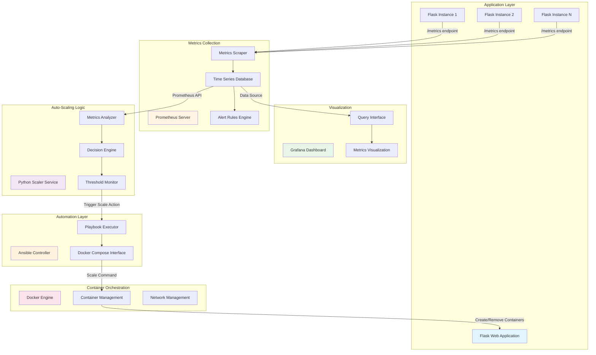

# Prometheus-Driven Auto-Scaling Simulator

A comprehensive local simulation environment demonstrating metrics-driven auto-scaling using Prometheus, Grafana, Python, Docker, and Ansible. This project showcases how to implement observability-driven automation patterns without requiring cloud infrastructure.

## Table of Contents

- [Architecture Overview](#architecture-overview)
- [Components](#components)
- [Prerequisites](#prerequisites)
- [Installation](#installation)
- [Configuration](#configuration)
- [Usage](#usage)
- [Monitoring and Visualization](#monitoring-and-visualization)
- [Scaling Logic](#scaling-logic)
- [Troubleshooting](#troubleshooting)
- [Production Considerations](#production-considerations)

## Architecture Overview



## Architecture Flow

### 1. Metrics Generation and Collection
- Flask application instances expose Prometheus-compatible metrics at `/metrics` endpoint
- Each instance generates synthetic response time and request count metrics
- Prometheus scrapes metrics from all application instances every 5 seconds
- Metrics are stored in Prometheus time-series database

### 2. Monitoring and Alerting
- Prometheus evaluates alert rules against collected metrics
- Grafana connects to Prometheus as a data source
- Real-time dashboards display current system state
- Historical data enables trend analysis

### 3. Auto-Scaling Decision Process
- Python scaler service polls Prometheus HTTP API every 10 seconds
- Queries average response time over 30-second window using PromQL
- Compares metrics against configured thresholds
- Determines required replica count based on current load

### 4. Scaling Execution
- Scaler triggers Ansible playbook when scaling is needed
- Ansible communicates with Docker daemon via Unix socket
- Docker Compose scales service to target replica count
- New containers register with Prometheus automatically

### 5. Feedback Loop
- Prometheus detects new application instances
- Begins scraping metrics from scaled containers
- Updated metrics feed back into decision process
- System stabilizes at appropriate scale level

## Components

### Flask Web Application
- **Purpose**: Simulates a production web service with variable performance characteristics
- **Metrics Exposed**: 
  - `webapp_response_time_seconds`: Simulated response latency
  - `webapp_request_count`: Simulated request volume
- **Technology**: Python Flask with prometheus_client library
- **Scalability**: Designed to run multiple replicas behind load balancer

### Prometheus Server
- **Purpose**: Metrics collection, storage, and query engine
- **Configuration**: 
  - Scrape interval: 5 seconds
  - Evaluation interval: 5 seconds
  - Retention: Default (15 days)
- **API**: Provides HTTP API for querying time-series data
- **Alert Rules**: Defines thresholds for system health monitoring

### Grafana Dashboard
- **Purpose**: Metrics visualization and analysis interface
- **Features**:
  - Pre-configured Prometheus data source
  - Custom dashboard for application metrics
  - Real-time and historical views
- **Access**: Web interface on port 3000
- **Authentication**: Default admin/admin credentials

### Python Scaler Service
- **Purpose**: Implements auto-scaling logic based on metrics
- **Algorithm**:
  - Queries average response time over 30-second window
  - Scale up if average exceeds 0.6 seconds
  - Scale down if average below 0.2 seconds
  - Respects minimum (1) and maximum (6) replica limits
- **Integration**: Triggers Ansible playbooks for scaling actions

### Ansible Automation
- **Purpose**: Executes infrastructure changes via playbooks
- **Capabilities**:
  - Interfaces with Docker daemon
  - Manages container lifecycle
  - Idempotent operations
- **Playbooks**: Scaling playbook adjusts service replica count

## Prerequisites

### Software Requirements
- Docker Engine 20.10 or higher
- Docker Compose 2.0 or higher
- Python 3.8 or higher (for local scaler execution)
- Ansible 2.9 or higher (installed in scaler container)
- Git for repository cloning

### System Requirements
- 4GB RAM minimum
- 10GB free disk space
- Linux, macOS, or Windows with WSL2

### Network Requirements
- Ports 3000, 8000, 9090 available
- Internet connection for pulling Docker images

## Installation

### Step 1: Clone Repository

```bash
git clone https://github.com/yourusername/prometheus-autoscale-sim.git
cd prometheus-autoscale-sim
```

### Step 2: Verify Prerequisites

```bash
docker --version
docker-compose --version
python3 --version
```

### Step 3: Build Docker Images

```bash
docker-compose build
```

This builds custom images for:
- Flask web application
- Python scaler service

Pre-built images are pulled for:
- Prometheus
- Grafana

### Step 4: Initialize Environment

```bash
chmod +x scripts/*.sh
./scripts/start.sh
```

The start script:
1. Creates necessary directories
2. Starts all services via Docker Compose
3. Waits for services to become healthy
4. Displays access URLs

## Configuration

### Prometheus Configuration

File: `prometheus/prometheus.yml`

```yaml
global:
  scrape_interval: 5s
  evaluation_interval: 5s

scrape_configs:
  - job_name: 'webapp'
    static_configs:
      - targets: ['webapp:8000']
    metrics_path: /metrics

rule_files:
  - "/etc/prometheus/rules/alert_rules.yml"
```

Key parameters:
- `scrape_interval`: How often to scrape metrics
- `evaluation_interval`: How often to evaluate alert rules
- `targets`: Service discovery for application instances

### Scaling Thresholds

File: `scaler/scaler.py`

```python
SCALE_UP_THRESHOLD = 0.6    # seconds
SCALE_DOWN_THRESHOLD = 0.2  # seconds
MAX_REPLICAS = 6
MIN_REPLICAS = 1
CHECK_INTERVAL = 10         # seconds
```

Modify these values to adjust scaling behavior:
- Lower `SCALE_UP_THRESHOLD` for more aggressive scaling
- Increase `CHECK_INTERVAL` to reduce scaling frequency
- Adjust `MAX_REPLICAS` based on resource constraints

### Alert Rules

File: `prometheus_rules/alert_rules.yml`

```yaml
groups:
  - name: webapp.rules
    rules:
      - alert: HighResponseTime
        expr: avg_over_time(webapp_response_time_seconds[30s]) > 0.5
        for: 10s
        labels:
          severity: warning
        annotations:
          summary: "webapp avg response time > 0.5s"
```

Alert rules define conditions for notifications but do not trigger auto-scaling in this implementation.

## Usage

### Starting the System

```bash
./scripts/start.sh
```

### Accessing Interfaces

- **Grafana**: http://localhost:3000 (admin/admin)
- **Prometheus**: http://localhost:9090
- **Web Application**: http://localhost:8000

### Generating Load

```bash
./scripts/load-test.sh
```

This script generates synthetic traffic to trigger scaling:

```bash
for i in {1..500}; do
    curl -s http://localhost:8000 > /dev/null
    sleep 0.01
done
```

### Monitoring Scaling Actions

Watch scaler logs in real-time:

```bash
docker-compose logs -f scaler
```

Expected output:
```
scaler_1  | avg_rt=0.75 current_replicas=1
scaler_1  | Scaling from 1 -> 2
scaler_1  | Running: ansible-playbook /ansible/playbook-scale.yml -e target_replicas=2
```

### Verifying Replica Count

```bash
docker-compose ps webapp
```

Or:

```bash
docker ps --filter "name=webapp"
```

### Stopping the System

```bash
./scripts/stop.sh
```

Or:

```bash
docker-compose down
```

## Monitoring and Visualization

### Grafana Dashboard Setup

1. Access Grafana at http://localhost:3000
2. Login with admin/admin
3. Navigate to Dashboards > Browse
4. Select pre-configured "Auto-Scaling Simulator" dashboard

### Key Metrics to Monitor

#### Response Time
- **Panel**: Time series graph
- **Query**: `webapp_response_time_seconds`
- **Purpose**: Shows current latency per instance

#### Average Response Time (30s window)
- **Panel**: Stat/gauge
- **Query**: `avg_over_time(webapp_response_time_seconds[30s])`
- **Purpose**: Metric used by scaler for decisions

#### Request Count
- **Panel**: Time series graph
- **Query**: `webapp_request_count`
- **Purpose**: Indicates load on system

#### Container Count
- **Panel**: Stat
- **Query**: `count(webapp_response_time_seconds)`
- **Purpose**: Shows current replica count

### Prometheus Query Examples

Execute these queries in Prometheus UI (http://localhost:9090/graph):

```promql
# Current response time for all instances
webapp_response_time_seconds

# Average response time over last minute
avg_over_time(webapp_response_time_seconds[1m])

# 95th percentile response time
histogram_quantile(0.95, webapp_response_time_seconds)

# Rate of requests per second
rate(webapp_request_count[1m])

# Total number of instances
count(up{job="webapp"})
```

## Scaling Logic

### Decision Algorithm

The scaler implements a threshold-based scaling algorithm:

```python
def decide_scale(avg_rt, current):
    if avg_rt is None:
        return None
    
    # Scale up condition
    if avg_rt > SCALE_UP_THRESHOLD and current < MAX_REPLICAS:
        return min(MAX_REPLICAS, current + 1)
    
    # Scale down condition
    if avg_rt < SCALE_DOWN_THRESHOLD and current > MIN_REPLICAS:
        return max(MIN_REPLICAS, current - 1)
    
    return None
```

### Scaling Workflow

1. **Metrics Query**: Scaler queries Prometheus for `avg_over_time(webapp_response_time_seconds[30s])`
2. **Current State**: Determines current replica count via Docker API
3. **Threshold Comparison**: Compares average response time against thresholds
4. **Decision**: Calculates target replica count respecting min/max limits
5. **Execution**: If scaling needed, triggers Ansible playbook
6. **Wait**: Sleeps for CHECK_INTERVAL before next evaluation

### Ansible Scaling Playbook

File: `ansible/playbook-scale.yml`

The playbook executes:
```bash
docker-compose up -d --scale webapp={{ target_replicas }}
```

This command:
- Starts or stops containers to reach target count
- Preserves existing containers when possible
- Updates service configuration
- Maintains network connectivity

## Troubleshooting

### Services Not Starting

Check Docker daemon status:
```bash
systemctl status docker
```

Verify port availability:
```bash
netstat -tuln | grep -E '3000|8000|9090'
```

### Prometheus Not Scraping Metrics

Verify target status in Prometheus UI:
- Navigate to http://localhost:9090/targets
- Check that webapp target shows "UP"

Check application logs:
```bash
docker-compose logs webapp
```

### Scaler Not Triggering

Verify Prometheus connectivity:
```bash
docker-compose exec scaler curl http://prometheus:9090/api/v1/query?query=up
```

Check scaler logs for errors:
```bash
docker-compose logs scaler
```

Verify Docker socket mount:
```bash
docker-compose exec scaler ls -la /var/run/docker.sock
```

### Grafana Dashboard Not Showing Data

Verify Prometheus data source:
- Go to Configuration > Data Sources
- Test Prometheus connection
- Ensure URL is http://prometheus:9090

Check time range in dashboard:
- Ensure time range includes recent data
- Refresh dashboard

### Scaling Not Occurring

Verify thresholds:
```bash
docker-compose exec scaler env | grep THRESHOLD
```

Check current metrics:
```bash
curl http://localhost:9090/api/v1/query?query=avg_over_time\(webapp_response_time_seconds[30s]\)
```

Verify Ansible installation:
```bash
docker-compose exec scaler ansible --version
```

## Production Considerations

### This Implementation
- Uses Docker socket mount for container management
- Polls Prometheus API for metrics
- Simple threshold-based scaling logic
- No authentication on internal services
- Single-host deployment

### Production Requirements

#### Security
- Remove Docker socket mount; use remote API with TLS
- Implement authentication for all services
- Use secrets management for credentials
- Enable Prometheus authentication
- Secure Grafana with SSO/LDAP

#### Scalability
- Replace polling with webhook-based triggers (Alertmanager)
- Implement Kubernetes Horizontal Pod Autoscaler
- Use multi-node cluster for high availability
- Add load balancer for traffic distribution
- Implement service mesh for observability

#### Reliability
- Add circuit breakers to prevent scaling storms
- Implement cooldown periods between scaling actions
- Add validation checks before scaling
- Use gradual rollout for scale-up operations
- Implement health checks and readiness probes

#### Observability
- Add distributed tracing (Jaeger/Zipkin)
- Implement structured logging
- Add custom business metrics
- Create runbooks for common scenarios
- Set up alerting and on-call rotation

#### Cost Optimization
- Implement predictive scaling based on historical patterns
- Add cost awareness to scaling decisions
- Use spot instances for non-critical workloads
- Implement resource quotas and limits
- Monitor and optimize resource utilization

### Cloud Migration Path

#### AWS Implementation
Replace local components with AWS services:
- **ECS/EKS**: Container orchestration
- **CloudWatch**: Metrics and monitoring
- **Application Auto Scaling**: Scaling policies
- **Lambda**: Event-driven scaling logic
- **Systems Manager**: Configuration management

#### Azure Implementation
- **AKS**: Kubernetes service
- **Azure Monitor**: Metrics and logs
- **Application Insights**: APM
- **Azure Automation**: Runbooks for scaling
- **Logic Apps**: Workflow orchestration

#### GCP Implementation
- **GKE**: Kubernetes service
- **Cloud Monitoring**: Metrics and alerting
- **Cloud Run**: Serverless containers
- **Cloud Functions**: Event-driven compute
- **Deployment Manager**: Infrastructure automation

Built using open-source technologies:
- Prometheus
- Grafana
- Docker
- Ansible
- Python Flask
